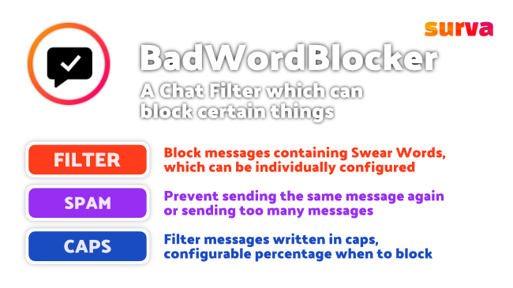

<p align="center">
    
</p>

<h1 align="center">BadWordBlocker</h1>
<p align="center">A Chat Filter which can block certain things</p>

<br>

<p align="center">
    <a href="https://poggit.pmmp.io/p/BadWordBlocker">
        
    </a>
    <a href="https://github.com/pmmp/PocketMine-MP">
        
    </a>
    <a href="https://poggit.pmmp.io/p/BadWordBlocker">
        
    </a>
    <a href="https://github.com/survanetwork/BadWordBlocker/blob/master/LICENSE">
        
    </a>
    <a href="https://discord.gg/t4Kg4j3829">
        
    </a>
    <a href="https://twitter.com/survanetwork">
        
    </a>
</p>

##

<p align="center">
    
</p>

✅ Ready for PocketMine-MP version 4.0 (PM4).

[• Description](#-description)  
[• Features](#-features)  
[• Usage](#-usage)  
[• Contribution](#-contribution)  
[• License](#%EF%B8%8F-license)

## 📙 Description
BadWorkBlocker is a chat filter suitable for every server to keep the chat clean from swear words and spam.
It can prevent swear words, sending the same message twice, sending too many messages and using caps lock.
It's highly configurable for nearly every needs.

## 🎁 Features
The main features of this plugin are:

- **SWEAR FILTER** Block messages containing swear words (specified in the config file)
- **BLOCK SAME MESSAGES** Show a warning to the player if he tries to send the same message twice
- **PREVENT SPAM** Prevent spam by preventing the player to send messages in an interval shorter than specified in the config
- **ANTI CAPS** Filter messages containing too much uppercase letters

## 🖱 Usage
All settings can be changed in the `config.yml`-file, there are no commands:

```yaml
# Language of the plugin messages
# Possible options are: en (English), de (German), fr (French), ru (Russian), tr (Turkish), id (Indonesian)
language: "en"

# List of the blocked words
badwords:
  - "fuck"
  - "shit"
  - "bitch"

# Ignore spaces in messages when checking for swear words / spam
ignorespaces: true

# Show the player which word has been blocked
showblocked: false

# Minimum time between chat messages in seconds
waitingtime: 2

# Percentage of uppercase chars in a message required to trigger caps checker
uppercasepercentage: 0.75

# Minimum amount of chars in a message required to activate caps checker (to avoid blocking HI, OK, etc.)
minimumchars: 3

# After how many violations against the chat filter, a player should be kicked/banned - set to 0 to disable
# Violations are reset after a server restart
violations:
  kick: 0
  ban: 0
  resetafterkick: true # reset violations after kick (this disables banning if kick-count is lower)
```

[Read the full documentation 📖](https://plugins.surva.net/docs/BadWordBlocker) • [Ask questions on Discord 💬](https://discord.gg/t4Kg4j3829)

## 🙋‍ Contribution
Feel free to contribute if you have ideas or found an issue.

You can:
- [open an issue](https://github.com/survanetwork/BadWordBlocker/issues) (problems, bugs or feature requests)
- [create a pull request](https://github.com/survanetwork/BadWordBlocker/pulls) (code contributions like fixed bugs or added features)
- [help translating the plugin](https://www.transifex.com/surva/badwordblocker) (help us to translate this plugin into your language on Transifex platform)

Please read our **[Contribution Guidelines](CONTRIBUTING.md)** before creating an issue or submitting a pull request.

Many thanks for their support to all contributors!

## 👨‍⚖️ License
[MIT](https://github.com/survanetwork/BadWordBlocker/blob/master/LICENSE)
